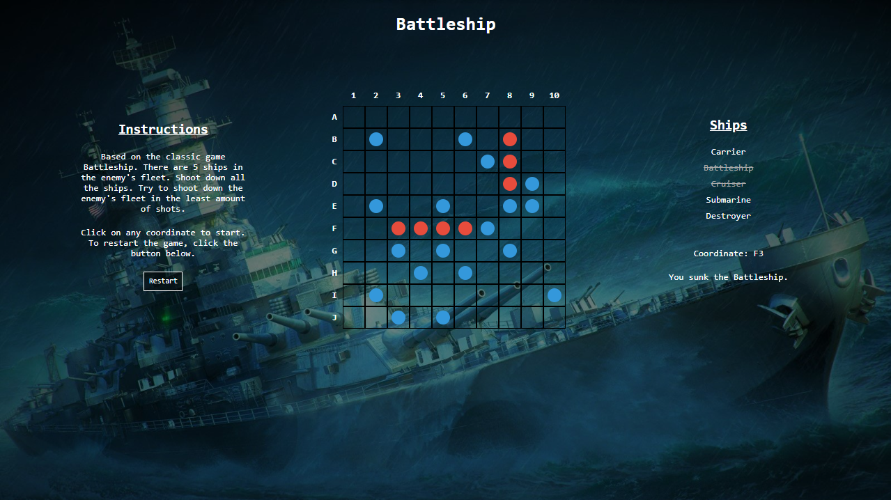

  <h1>Battleship</h1>
  
  

    A remake of the classic game battleship.
  

<h4>
    <a href="https://excelsior2021.github.io/battleship">View Project</a>

 

<!-- About the Project -->

## Motivation

This was my first project that used JavaScript. I wanted to build a web application that focused on using JavaScript for DOM manipulation and application logic at a basic level. This project achieved this and solidified my understanding and set me up for building more complex web applications. I still work on projects such as this in order to improve my programming by implementing best practices and learning and implementing new concepts.

<!-- TechStack -->

## Tech Stack

### Client

- HTML
- CSS
- JavaScript

### Dev

- [Webpack](https://webpack.js.org/)
- [Vitest](https://vitest.dev)
- [Happy DOM](https://github.com/capricorn86/happy-dom)

## Approach

This project takes a functional approach and is event-driven (because it's a game). All the functions declared are pure functions apart from the entry point function `startGame()`, an IIFE (Immediately Invoked Function Expression).

The source code is bundled with webpack.

Vitest was used to perform unit testing.

## Deployment

This project was deployed with GitHub Pages as a static site.

## Enhancements

This project can be enhanced with the following features:

- Multiplayer - Building a server that we allow for up to two players to play against one another from separate connections.
- Database - A database for storing users' scores.
- Improved UI/UX - A more modern approach to buiding an HTML game. Perhaps with a frontend framework. More animations.
